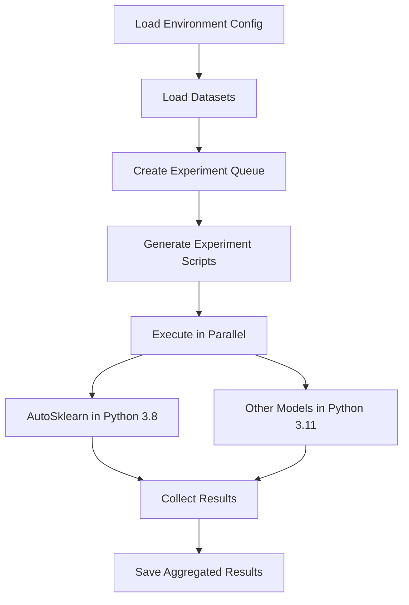

# ML Comparison Study - Multi-Environment Setup

This project now supports **multi-environment setup** to handle dependency conflicts between different ML models, specifically:

- **Auto-sklearn** requires Python 3.8
- **AutoGluon** and other modern models work with Python 3.11

## 🏗️ Architecture Overview

The solution creates separate conda environments for different model groups:

| Environment | Python Version | Models |
|-------------|----------------|--------|
| `ml_autosklearn_py38` | 3.8 | Auto-sklearn |
| `ml_modern_py311` | 3.11 | AutoGluon, XGBoost, LightGBM, CatBoost, EBM |

The experiment coordinator (`run_experiments_multienv.py`) automatically:
1. Creates isolated experiment scripts for each model/dataset combination
2. Executes them in the appropriate conda environment
3. Runs experiments in parallel (up to 4 concurrent environments)
4. Collects and aggregates results

## 🚀 Quick Start

### 1. Prerequisites

- **Linux/WSL2** environment (required for Auto-sklearn)
- **Conda** (Miniconda or Anaconda)
- **sudo access** (for installing system dependencies)

### 2. Setup Multi-Environment

```bash
# Run the multi-environment setup
./setup_multi_environment.sh
```

This will:
- Install system dependencies (`build-essential`, `swig`, `python3-dev`)
- Create two conda environments with appropriate Python versions
- Install model-specific packages in each environment
- Create activation scripts and configuration files

### 3. Prepare Data

```bash
# Activate the modern environment for data preparation
source activate_modern_env.sh

# Run data preparation pipeline
python fetch_datasets.py
python preprocess.py
python split_data.py

# Deactivate environment
conda deactivate
```

### 4. Run Experiments

```bash
# Launch multi-environment experiments
./launch_experiments.sh
```

Or manually:

```bash
# Activate the modern environment to run the coordinator
source activate_modern_env.sh

# Run the multi-environment experiment coordinator
python run_experiments_multienv.py

conda deactivate
```

## 📁 File Structure

```
├── setup_multi_environment.sh      # Multi-environment setup script
├── launch_experiments.sh           # Experiment launcher
├── run_experiments_multienv.py     # Multi-environment coordinator
├── requirements_python38.txt       # Python 3.8 dependencies
├── requirements_python311.txt      # Python 3.11 dependencies
├── activate_autosklearn_env.sh     # Auto-sklearn environment activation
├── activate_modern_env.sh          # Modern ML environment activation
├── envs/
│   └── environment_config.json     # Environment configuration
├── data/
│   ├── raw/                        # Original datasets
│   ├── processed/                  # Cleaned datasets
│   └── split/                      # Train/test splits
├── results/
│   ├── raw/                        # Individual experiment results
│   └── execution_summary.json     # Overall execution summary
└── logs/                          # Experiment logs
```

## 🔧 Environment Details

### Auto-sklearn Environment (Python 3.8)

```bash
# Activate
source activate_autosklearn_env.sh

# Packages installed:
# - auto-sklearn
# - scikit-learn
# - numpy, pandas, scipy
# - System: build-essential, swig, python3-dev
# - Compilers: gxx_linux-64, gcc_linux-64
```

### Modern ML Environment (Python 3.11)

```bash
# Activate
source activate_modern_env.sh

# Packages installed:
# - autogluon
# - xgboost, lightgbm, catboost
# - interpret (EBM)
# - Latest versions of numpy, pandas, scikit-learn
```

## 🏃‍♂️ How It Works

### Multi-Environment Coordination

1. **Environment Mapping**: Each model is mapped to its appropriate environment
2. **Script Generation**: For each experiment, a standalone Python script is generated
3. **Conda Execution**: Each script runs in its designated conda environment
4. **Parallel Processing**: Up to 4 experiments run simultaneously
5. **Result Aggregation**: All results are collected and saved

### Experiment Execution Flow



## 📊 Results

Results are saved in multiple formats:

- **Individual Results**: `results/raw/{model}_{dataset}.json`
- **Execution Summary**: `results/execution_summary.json`
- **Logs**: `experiments_multienv.log` and individual model logs

## 🐛 Troubleshooting

### Environment Issues

```bash
# Check environments
conda env list

# Test Auto-sklearn environment
source activate_autosklearn_env.sh
python -c "import autosklearn; print(autosklearn.__version__)"
conda deactivate

# Test Modern environment
source activate_modern_env.sh
python -c "import autogluon; import catboost; import xgboost; import lightgbm; import interpret; print('All modern models imported successfully!')"
conda deactivate
```

### Common Issues

1. **Auto-sklearn Import Error**: Ensure system dependencies are installed
2. **Permission Denied**: Make sure scripts are executable (`chmod+x`)
3. **Missing Datasets**: Run the data preparation pipeline first
4. **Memory Issues**: Reduce parallel workers in `run_experiments_multienv.py`

## 🔄 Migration from Single Environment

If you have an existing single-environment setup:

1. **Backup your results**: `cp -r results results_backup`
2. **Run new setup**: `./setup_multi_environment.sh`
3. **Use new launcher**: `./launch_experiments.sh`

The new system is compatible with existing data and model implementations.

## ⚙️ Configuration

### Adjusting Parallelism

In `run_experiments_multienv.py`, modify:

```python
max_workers = min(4, len(experiment_queue))  # Adjust number
```

### Adding New Models

1. Add model to appropriate environment in `envs/environment_config.json`
2. Update requirements files as needed
3. Ensure model class is imported in experiment scripts

### Environment Customization

Edit `setup_multi_environment.sh` to:
- Add new environments
- Modify Python versions
- Include additional system dependencies

## 📈 Performance Benefits

- **Isolation**: No dependency conflicts between models
- **Parallel Execution**: Multiple models train simultaneously
- **Resource Management**: Limited concurrent environments prevent system overload
- **Fault Tolerance**: Failed experiments don't affect others

## 🎯 Next Steps

1. Run the setup: `./setup_multi_environment.sh`
2. Prepare your data
3. Launch experiments: `./launch_experiments.sh`
4. Analyze results with existing tools (`stat_analysis.py`)

Happy experimenting! 🔬✨ 